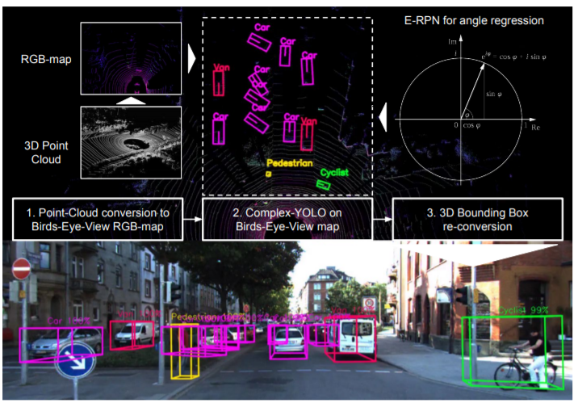

# List of sources

## Atlas: End-to-End 3D Scene Reconstruction from Posed Images

* [Atlas](https://github.com/magicleap/Atlas.git)

## Complex-YOLO: Real-time 3D Object Detection on Point Clouds

* [Complex-YOLO](https://github.com/maudzung/Complex-YOLOv4-Pytorch.git)

## PX4-ROS2-Gazebo-YOLOv8

* [PX4-ROS2-Gazebo-YOLOv8](https://github.com/monemati/PX4-ROS2-Gazebo-YOLOv8.git)

